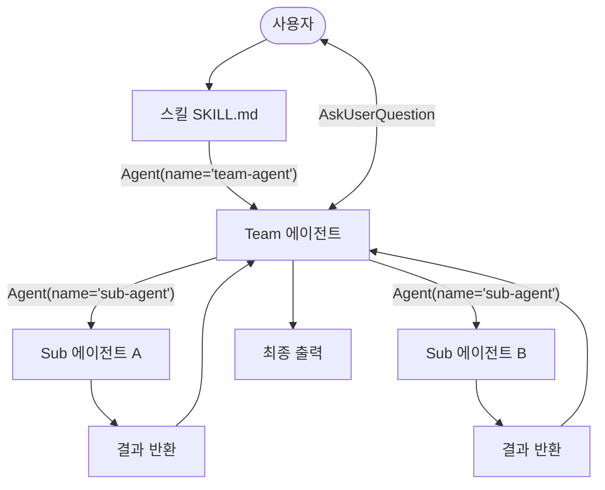
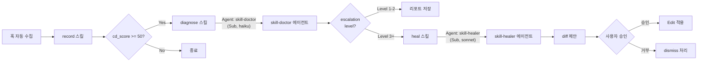
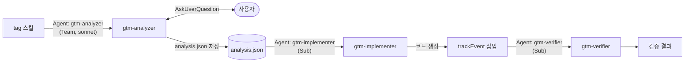
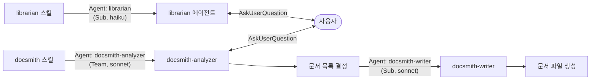

<!-- docsmith: auto-generated 2026-03-27 -->

# 에이전트 파이프라인 패턴

jake-marketplace 플러그인이 사용하는 에이전트 구성 패턴을 정리합니다.
Team 에이전트와 Sub 에이전트의 구분, 파이프라인 연결 방식, 실제 플러그인 구현 사례를 다룹니다.

## 핵심 구분: Team 에이전트 vs Sub 에이전트

플러그인 에이전트는 사용자 소통 가능 여부에 따라 두 유형으로 나뉩니다.

| 속성 | Team 에이전트 | Sub 에이전트 |
|------|-------------|-------------|
| `AskUserQuestion` 도구 | 포함 | 미포함 |
| 사용자 소통 | 직접 가능 | 불가 (결과만 반환) |
| 실행 방식 | 스킬에서 스폰, 사용자와 인터랙션 | 다른 에이전트 또는 스킬에서 스폰 |
| 모델 | sonnet (판단 필요) | haiku 또는 sonnet |
| 역할 | 분석·결정·인터뷰 | 처리·생성·검증 |

## 에이전트 파이프라인 다이어그램



## 플러그인별 파이프라인 구현

### skill-doctor — 자동 체이닝 파이프라인

스킬들이 cd_score와 escalation_level 기반으로 자동으로 다음 스킬을 트리거합니다.



**skill-doctor** (Sub 에이전트, haiku): 진단 데이터를 받아 health_score 계산, 에스컬레이션 레벨 결정, 리포트 생성. 직접 Edit 불가.

**skill-healer** (Sub 에이전트, sonnet): diagnose JSON + 스킬 파일 + heal_tracking을 받아 before/after diff 생성. 직접 Edit 불가. 실제 적용은 heal 스킬이 수행.

### gtm-tag — 분석→구현→검증 파이프라인

사용자 소통이 필요한 분석 단계와 자동 처리 단계를 분리합니다.



**gtm-analyzer** (Team 에이전트, sonnet): CSV 파싱, 컴포넌트 매핑, 모호한 케이스를 AskUserQuestion으로 해결. `allDecisionsResolved: true`가 될 때까지 사용자와 소통.

**gtm-implementer** (Sub 에이전트): analysis.json을 읽어 실제 코드 삽입. 사용자 소통 없이 자동 처리.

**gtm-verifier** (Sub 에이전트): 구현 결과 검증.

### obsidian-nexus — 분석→작성 파이프라인



**docsmith-analyzer** (Team 에이전트, sonnet): 코드베이스 분석, 갭 리포트, AskUserQuestion으로 인터뷰(3회 이내). 생성할 문서 목록을 결정하여 writer에게 전달.

**docsmith-writer** (Sub 에이전트, sonnet): 결정된 문서 목록에 따라 실제 파일 생성. 코드에서 확인한 사실만 작성.

**librarian** (Sub 에이전트, haiku): 검색 실패 후 발견성 개선, 문서 최신화, 문서 생성 제안. 수정 전 AskUserQuestion으로 사용자 승인을 받지만 alias 추가는 승인 없이 자동 처리.

## 에이전트 정의 위치 규칙

Claude Code는 `Agent` 도구 호출 시 `name` 파라미터로 에이전트를 찾습니다.
플러그인 에이전트는 `agents/` 디렉토리의 파일명(확장자 제외)으로 매칭됩니다.

```python
# 스킬 또는 다른 에이전트에서 호출
Agent(
    name="skill-doctor",        # agents/skill-doctor.md 와 매칭
    description="skill-doctor 진단",
    prompt="diagnose JSON: ..."
)
```

## 데이터 전달 패턴

에이전트 간 데이터는 두 가지 방식으로 전달됩니다.

**프롬프트 인라인**: 에이전트 호출 시 `prompt` 파라미터에 JSON 또는 텍스트로 포함.
skill-doctor와 skill-healer가 diagnose JSON을 이 방식으로 전달받습니다.

**파일 경유**: 중간 결과를 파일로 저장하고 다음 에이전트가 읽음.
gtm-analyzer가 `analysis.json`을 저장하고 gtm-implementer가 읽는 방식입니다.

## 마켓플레이스 스킬 보호 규칙

마켓플레이스에서 설치된 스킬(`source: "marketplace"`)은 heal 대상에서 제외됩니다.
skill-healer는 `diagnose JSON`의 `source` 필드가 `"marketplace"`이면 diff 생성을 거부하고 종료합니다.
이는 외부 플러그인 파일의 무단 수정을 방지합니다.

## 관련 문서

- [[플러그인 해부도]]
- [[훅 시스템]]
