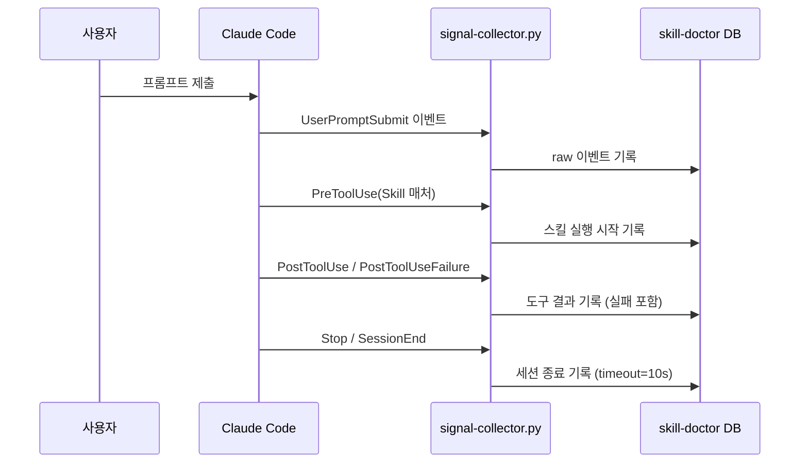

<!-- docsmith: auto-generated 2026-03-27 -->

# 훅 시스템

Claude Code 이벤트 훅을 활용하여 플러그인이 세션 이벤트에 자동으로 반응하는 구조를 설명합니다.
현재 jake-marketplace에서 훅을 사용하는 플러그인은 **skill-doctor**입니다.

## 훅이란

Claude Code는 세션 중 특정 이벤트가 발생할 때 외부 명령을 자동으로 실행하는 훅 메커니즘을 제공합니다.
플러그인은 `hooks/hooks.json` 파일로 훅을 등록합니다.

## hooks.json 구조

```json
{
  "description": "훅 설명",
  "hooks": {
    "{EventName}": [
      {
        "matcher": "{정규식 또는 빈 문자열}",
        "hooks": [
          {
            "type": "command",
            "command": "실행할 명령어",
            "timeout": 5
          }
        ]
      }
    ]
  }
}
```

## skill-doctor 훅 상세

skill-doctor는 6개의 Claude Code 이벤트에 `signal-collector.py`를 연결합니다.

```json
{
  "hooks": {
    "PreToolUse": [
      { "matcher": "Skill", "command": "python3 \"$CLAUDE_PLUGIN_ROOT/scripts/signal-collector.py\"", "timeout": 3 }
    ],
    "PostToolUse": [
      { "matcher": ".*", "command": "python3 \"$CLAUDE_PLUGIN_ROOT/scripts/signal-collector.py\"", "timeout": 5 }
    ],
    "PostToolUseFailure": [
      { "matcher": ".*", "command": "python3 \"$CLAUDE_PLUGIN_ROOT/scripts/signal-collector.py\"", "timeout": 5 }
    ],
    "UserPromptSubmit": [
      { "matcher": ".*", "command": "python3 \"$CLAUDE_PLUGIN_ROOT/scripts/signal-collector.py\"", "timeout": 3 }
    ],
    "Stop": [
      { "matcher": "", "command": "python3 \"$CLAUDE_PLUGIN_ROOT/scripts/signal-collector.py\"", "timeout": 10 }
    ],
    "SessionEnd": [
      { "matcher": "", "command": "python3 \"$CLAUDE_PLUGIN_ROOT/scripts/signal-collector.py\"", "timeout": 10 }
    ]
  }
}
```

## 이벤트 유형별 역할



| 이벤트 | matcher | timeout | 수집 목적 |
|--------|---------|---------|-----------|
| `PreToolUse` | `Skill` | 3s | 스킬 실행 시작 감지 |
| `PostToolUse` | `.*` | 5s | 모든 도구 성공 결과 수집 |
| `PostToolUseFailure` | `.*` | 5s | 도구 실패(`tool_error` 시그널) 수집 |
| `UserPromptSubmit` | `.*` | 3s | 사용자 입력 패턴 수집 |
| `Stop` | `""` | 10s | 세션 중단 시 최종 기록 (여유 timeout) |
| `SessionEnd` | `""` | 10s | 정상 세션 종료 시 최종 기록 |

`Stop`과 `SessionEnd` 모두 등록된 이유: Claude Code가 종료되는 방식(강제 중단 vs 정상 종료)에 따라 발생하는 이벤트가 다르기 때문입니다.

## matcher 규칙

- **정규식 문자열**: 도구명 또는 이벤트 메타데이터에 매칭. `"Skill"`은 스킬 도구 실행만, `".*"`은 모든 이벤트에 반응
- **빈 문자열 `""`**: `Stop`, `SessionEnd`처럼 매처가 의미 없는 이벤트에 사용

## 환경 변수

훅 명령어에서 사용 가능한 환경 변수:

| 변수 | 값 |
|------|-----|
| `$CLAUDE_PLUGIN_ROOT` | 플러그인 설치 경로 (예: `~/.claude/plugins/cache/jake-plugins/skill-doctor/0.1.0`) |

이 변수를 통해 플러그인 스크립트를 절대 경로로 안전하게 참조합니다.

## 자동 수집과 수동 기록의 분담

훅 기반 자동 수집은 모든 이벤트를 raw로 기록하지만, 의미 해석은 Claude가 수행합니다.

```
훅 자동 수집 → signal-collector.py → raw DB
                                           ↓
                         Claude (Stop 시) → 유의미한 시그널 판별 → DB 기록
```

훅으로 감지하기 어려운 시그널(redo, manual_fix, clarify, blocked)은 `/skill-doctor:record` 스킬로 수동 보완합니다.

## 관련 문서

- [[플러그인 해부도]]
- [[에이전트 파이프라인 패턴]]
