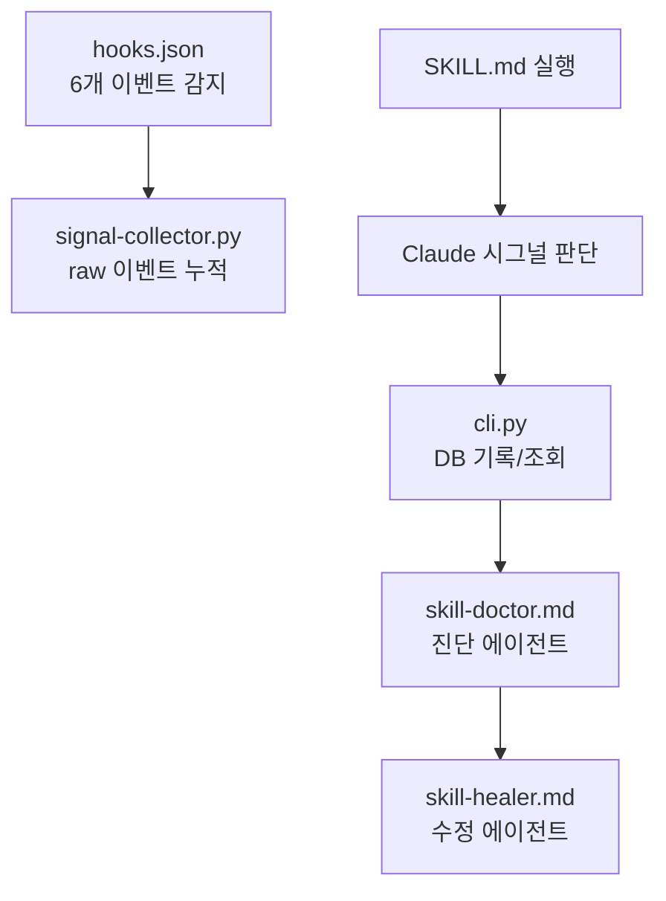

<!-- docsmith: auto-generated 2026-03-27 -->

# 플러그인 시스템 구조

jake-marketplace의 각 플러그인이 어떻게 구성되고 작동하는지를 설명합니다.

## 플러그인 디렉토리 구조

플러그인은 `plugins/{name}/` 아래에 다음 구조를 따릅니다.

```
plugins/{name}/
├── .claude-plugin/
│   └── plugin.json        ← 플러그인 메타데이터 (이름, 버전, 설명)
├── skills/
│   └── {skill-name}/
│       └── SKILL.md       ← 스킬 프롬프트 정의
├── agents/
│   └── {agent-name}.md    ← 에이전트 프롬프트 정의 (frontmatter + 지시문)
├── hooks/
│   └── hooks.json         ← Claude Code 훅 이벤트 핸들러 (선택)
├── scripts/               ← CLI 등 실행 스크립트 (선택)
├── templates/             ← 문서/코드 템플릿 (선택)
├── module/                ← 번들 코드 (선택, gtm-tag만 해당)
├── docs/                  ← 플러그인 자체 문서
└── README.md
```

## 구성 요소별 역할

### SKILL.md — 스킬

Claude Code에서 `/plugin-name:skill-name` 명령어로 호출되는 프롬프트입니다.
사용자가 명령어를 입력하면 해당 SKILL.md의 내용이 Claude에게 주입됩니다.

```
/skill-doctor:dashboard   → plugins/skill-doctor/skills/dashboard/SKILL.md
/gtm-tag:tag              → plugins/gtm-tag/skills/tag/SKILL.md
/obs-nexus:onboard        → plugins/obsidian-nexus/skills/onboard/SKILL.md
```

### agents/*.md — 에이전트

스킬이 위임하는 서브에이전트 정의입니다. frontmatter에 모델, 도구, 역할을 명시합니다.

```yaml
---
name: librarian
description: 옵시디언 문서 관리 사서
model: haiku          # claude-haiku / claude-sonnet / claude-opus
tools:
  - Read
  - Write
  - Bash
  - AskUserQuestion
---
```

에이전트는 역할에 따라 두 종류로 구분됩니다.

| 종류 | 설명 | 사용자 상호작용 |
|------|------|----------------|
| Team 에이전트 | 사용자와 AskUserQuestion으로 직접 소통 | 가능 |
| Sub 에이전트 | 스킬/다른 에이전트가 위임, 순수 실행 | 불가 |

### hooks/hooks.json — 훅

Claude Code 이벤트에 자동으로 반응하는 핸들러입니다. `skill-doctor`가 사용합니다.

감지 가능한 이벤트:
- `PostToolUseFailure` — 도구 실행 실패
- `PostToolUse` — 도구 실행 완료 (stdout 패턴 감지)
- `UserPromptSubmit` — 사용자 메시지 입력

## 플러그인별 구조 요약

### skill-doctor



스킬 9개: `init`, `dashboard`, `diagnose`, `heal`, `record`, `report`, `suggest`, `create`, `checkup`

에이전트 2개:
- `skill-doctor.md` — 진단 (haiku)
- `skill-healer.md` — 셀프힐링 (sonnet)

### gtm-tag

```mermaid
graph LR
    Tag[/gtm-tag:tag] --> Analyzer[gtm-analyzer<br/>Team - sonnet/opus]
    Analyzer -->|analysis.json| Implementer[gtm-implementer<br/>Sub - sonnet]
    Implementer -->|변경 요약| Verifier[gtm-verifier<br/>Sub - opus]
```

스킬 3개: `init`, `tag`, `doctor`

에이전트 3개:
- `gtm-analyzer.md` — CSV 파싱, 컴포넌트 매핑 (Team, sonnet/opus)
- `gtm-implementer.md` — 이벤트 정의 파일 생성, trackEvent 삽입 (Sub, sonnet)
- `gtm-verifier.md` — 커버리지 검증 (Sub, opus)

### obsidian-nexus

```mermaid
graph LR
    Onboard[/obs-nexus:onboard] --> Analyzer[docsmith-analyzer<br/>sonnet]
    Analyzer --> Writer[docsmith-writer<br/>sonnet]
    Librarian[/obs-nexus:librarian] --> LibAgent[librarian<br/>haiku]
```

스킬 5개: `onboard`, `add`, `doctor`, `librarian`, `session-devlog`

에이전트 3개:
- `docsmith-analyzer.md` — 프로젝트 분석 + 사용자 인터뷰 (sonnet)
- `docsmith-writer.md` — 문서 작성 (sonnet)
- `librarian.md` — 문서 검색/관리 (haiku)

## 설치 후 파일 위치

플러그인을 설치하면 `~/.claude/` 아래에 복사됩니다.

```
~/.claude/
├── skill-doctor/
│   ├── skill-doctor.db        ← 시그널 DB (재설치해도 유지)
│   ├── reports/               ← 진단 리포트 (90일 자동 삭제)
│   ├── tmp/                   ← 임시 파일 (자동 삭제)
│   └── active/                ← 실행 중 세션 시그널 누적
└── plugins/
    └── {plugin-name}/         ← 플러그인 파일 복사 위치
```

## 플러그인 개발 규칙

1. `SKILL.md`는 Claude에게 주입되는 프롬프트이므로 명확한 단계 지시가 필요합니다.
2. 에이전트 frontmatter의 `model`은 작업 복잡도에 맞게 선택합니다 (haiku → sonnet → opus).
3. 사용자 승인이 필요한 작업은 `AskUserQuestion` 도구를 사용합니다.
4. 스킬 종료 시 `AskUserQuestion`으로 다음 단계를 추천하는 것이 권장 패턴입니다.
5. Python CLI는 외부 패키지 없이 표준 라이브러리만 사용합니다.

## 관련 문서

- [[프로젝트 개요]]
- [[용어 사전]]
