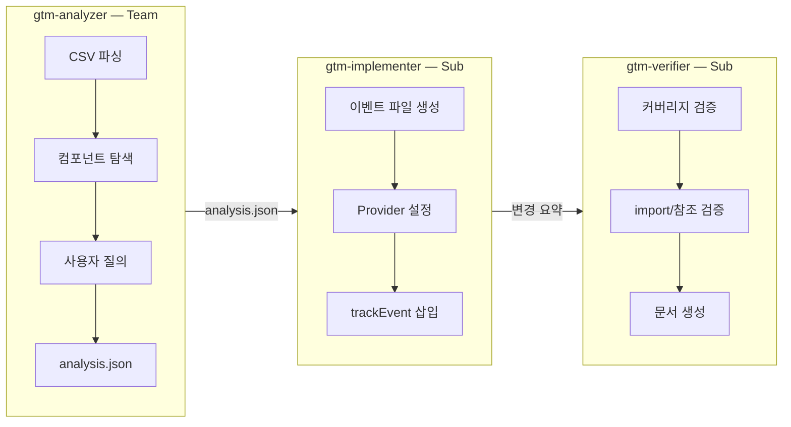
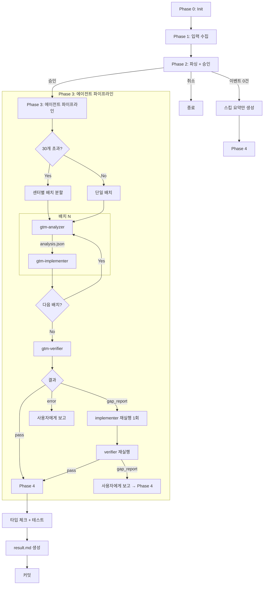

# gtm-tag

기획자의 GA4 이벤트 CSV를 파싱하여 **gtm-tracker 모듈 기반으로 이벤트 정의 파일 생성 + React 컴포넌트에 trackEvent 호출을 자동 삽입**하는 플러그인. 3단계 서브에이전트 파이프라인(분석 → 구현 → 검증)으로 자동화합니다.

## 설치

```bash
/plugin marketplace add gorillaProject/jake-marketplace
/plugin install gtm-tag@jake-plugins
```

## 사용법

### 1. 프로젝트 초기화

```
/gtm-tag:init
```

프로젝트별 설정(`project-config.md`)을 생성하고 gtm-tracker 모듈을 설치합니다.
설정 파일은 프로젝트의 `gtm-tag/project-config.md`에 저장됩니다.

수집하는 설정:
- gtm-tracker 모듈 경로 및 import alias
- 이벤트 파일 출력 디렉토리
- 앱 루트 파일 (GTMTrackerProvider 설정)
- Host App 공통 변수 (이벤트 params에서 제외)
- 패키지 매니저 명령어 (타입 체크, 테스트, 스냅샷 업데이트 — 각각 수집)
- 센터별 그룹 매핑 (prefix, 라우트)
- 스킵 규칙, CSV 헤더 포맷

### 2. 이벤트 태깅 실행

```
/gtm-tag:tag
/gtm-tag:tag __docs__/tag/task/20260316/events.csv
```

CSV를 기반으로 이벤트 정의 파일을 생성하고 컴포넌트에 trackEvent를 삽입합니다.

```
CSV (기획자 제공)
  → requirement.md          (Phase 2: 파싱 + 승인)
  → analysis.json           (Analyzer: 컴포넌트 매핑)
  → *.events.ts             (Implementer: 이벤트 정의 파일)
  → 컴포넌트 수정            (Implementer: trackEvent 삽입)
  → event-coverage.md       (Verifier: 커버리지 검증)
  → integration-guide.md    (Verifier: 통합 가이드)
  → result.md               (Phase 4: 기획자 전달용 최종 산출물)
```

### 3. 설정 진단 및 수정

```
/gtm-tag:doctor
/gtm-tag:doctor --fix
```

project-config, 모듈, Provider, import 경로 등 15개 항목을 자동 진단하고 문제를 수정합니다.

---

## 사용 가능한 명령어

| 명령어 | 설명 |
|---|---|
| `/gtm-tag:init` | 프로젝트 초기 설정 (config, 모듈, Provider) |
| `/gtm-tag:tag [CSV경로]` | GA4 이벤트 태깅 자동화 |
| `/gtm-tag:doctor [--fix]` | 설정/모듈/Provider 진단 + 자동 수정 |

각 스킬은 종료 시 AskUserQuestion으로 다음 단계를 추천합니다.

---

## 핵심 개념

### gtm-tracker 모듈

플러그인에 번들된 경량 GTM 트래킹 모듈입니다. init 시 프로젝트에 복사됩니다 (`__tests__/` 제외).

| 파일 | 역할 |
|------|------|
| `tracker.ts` | `createTracker()` — dataLayer push, debug 모드 |
| `registry.ts` | `defineEvents(prefix, schema)` — 타입 안전 이벤트 정의 |
| `validation.ts` | dev 환경 필수 파라미터/타입 검증 |
| `types.ts` | EventDef, Tracker, TrackerConfig 등 타입 |
| `react/provider.tsx` | `<GTMTrackerProvider>` — Context Provider |
| `react/hooks.ts` | `useTrackEvent()`, `useTracker()` — React hooks |

### 이벤트 네이밍 규칙

```
dataLayer 이벤트명: {prefix}_{domain}_{action}
GA4 이벤트명:      {domain}_{action}  (GTM에서 prefix 제거)
```

- **prefix**: 센터별 팀 식별자 (da, bm 등) — 네임스페이스 분리
- **domain**: 기능 영역 (ads, campaign, monitor 등)
- **action**: 구체적 동작 (click_download, view_detail 등)

예시: `da_ads_campaign_manage_click` → GA4: `ads_campaign_manage_click`

### Host App 공통 변수

`workspace_id`, `user_id` 등 Host App이 페이지 진입 시 dataLayer에 자동 push하는 변수. 개별 이벤트 파라미터에서 **제외**하여 중복을 방지합니다. project-config.md에서 설정.

### 배칭

30개 초과 이벤트는 센터별 배치로 분할하여 순차 실행합니다.

```
배치 1: analyzer → implementer
배치 2: analyzer → implementer
  ...
전체 완료 후: verifier (1회)
```

---

## 에이전트

| 에이전트 | 타입 | 모델 | 역할 |
|---------|------|------|------|
| gtm-analyzer | Team | sonnet/opus | CSV → 컴포넌트 매핑 + 사용자 질의 (모호성 해결) |
| gtm-implementer | Sub | sonnet | 이벤트 정의 파일 생성 + trackEvent 삽입 |
| gtm-verifier | Sub | opus | 커버리지 검증 + event-coverage.md, integration-guide.md 생성 |

**Team vs Sub**: Team 에이전트(analyzer)는 사용자와 AskUserQuestion으로 소통 가능. Sub 에이전트(implementer, verifier)는 사용자 상호작용 없이 순수 실행.

### 에이전트 파이프라인



---

## 워크플로우



### Phase별 상세

| Phase | 역할 | 산출물 |
|-------|------|--------|
| **0: Init** | config 확인, 모듈/Provider 설치 | project-config.md |
| **1: 입력 수집** | CSV 경로 또는 직접 입력 | CSV 데이터 |
| **2: 파싱 + 승인** | 센터별 그룹핑, 스킵 필터링, 사용자 승인 | requirement.md |
| **3: 에이전트** | 분석 → 구현 → 검증 | analysis.json, *.events.ts, trackEvent 삽입 |
| **4: 결과** | 타입 체크, 테스트, 문서 생성 | result.md, event-coverage.md, integration-guide.md |

---

## Doctor 진단 항목

`/gtm-tag:doctor`는 6개 카테고리 15개 항목을 검사합니다:

| 카테고리 | 체크 항목 | 자동 수정 |
|---------|----------|----------|
| **Config** | 파일 존재, 플레이스홀더 잔존, 필수 섹션 | init 위임 / 값 수집 |
| **Module** | 디렉토리 존재, 파일 완전성, 핵심 export | 플러그인에서 복사 |
| **Import** | tsconfig/jsconfig paths 매칭, import 일관성 | paths 추가 / alias 수정 |
| **Provider** | GTMTrackerProvider 존재, tracker 인스턴스, 중복 | 자동 삽입 |
| **Events** | 디렉토리 존재, TypeScript 유효성 | mkdir / tsc 수정 |
| **Group** | prefix 중복, 라우트 유효성 | 경고 (수동) |

`--fix` 모드로 자동 수정, 수정 후 재진단까지 한 사이클로 처리합니다.

---

## 프로젝트 설정 파일

`/gtm-tag:init`이 생성하는 `gtm-tag/project-config.md`의 구조:

| 섹션 | 내용 | 예시 |
|------|------|------|
| gtm-tracker 모듈 | 경로, import alias | `src/utils/gtm-tracker/`, `utils/gtm-tracker` |
| 이벤트 파일 출력 | 디렉토리, 파일 패턴 | `src/events/`, `{group}.events.ts` |
| 앱 루트 | Provider 설정 대상 | `src/Main.tsx` |
| Host App 공통 변수 | 이벤트 params 제외 목록 | `workspace_id`, `user_id` |
| 패키지 매니저 | 타입 체크, 테스트, 스냅샷 업데이트 (각각) | `pnpm tsc --noEmit`, `pnpm test`, `pnpm test -- -u` |
| 그룹 매핑 | 센터, prefix, 라우트 | da-center / da / /da-center/ads |
| 스킵 규칙 | 제외 대상 | feed-center 이벤트 SKIP |
| CSV 헤더 | 기획자 CSV 포맷 | `페이지,경로,카테고리,...` |

---

## skill-doctor 연동

gtm-tag의 모든 스킬은 종료 시 skill-doctor 시그널을 자동 기록합니다.

```
스킬 실행 중 이벤트 발생 → 메모리에 누적
  ↓
스킬 종료 → Write(~/.claude/skill-doctor/tmp/sd-session-{timestamp}.json)
  ↓
skill-doctor CLI record → DB 기록, CD 점수 계산
  ↓
CD ≥ 50 → diagnose → 자동 진단
```

skill-doctor가 미설치된 경우, 설치 여부를 질문하고 `/skill-doctor:init`까지 안내합니다.

---

## 플러그인 구조

```
plugins/gtm-tag/
├── .claude-plugin/
│   └── plugin.json                ← 플러그인 메타데이터
├── skills/
│   ├── init/SKILL.md              ← /gtm-tag:init
│   ├── tag/SKILL.md               ← /gtm-tag:tag
│   └── doctor/SKILL.md            ← /gtm-tag:doctor
├── agents/
│   ├── gtm-analyzer.md            ← Team 에이전트 (sonnet/opus)
│   ├── gtm-implementer.md         ← Sub 에이전트 (sonnet)
│   └── gtm-verifier.md            ← Sub 에이전트 (opus)
├── templates/
│   ├── project-config-template.md ← project-config 기본 템플릿
│   ├── requirement-template.md    ← 요구사항 문서 포맷
│   └── result-template.md         ← 결과 문서 포맷
├── module/                        ← gtm-tracker 모듈 번들
│   ├── index.ts, tracker.ts, registry.ts, types.ts, validation.ts, global.d.ts
│   ├── react/ (provider.tsx, hooks.ts, index.ts)
│   └── __tests__/ (프로젝트 복사 시 제외)
├── docs/
│   └── README.md                  ← 워크플로우 다이어그램
└── README.md                      ← 이 파일
```

## 요구사항

- React SPA 프로젝트 (CRA, Vite 등) — Next.js는 미지원
- TypeScript (또는 jsconfig.json 기반 JavaScript)
- tsconfig.json 또는 jsconfig.json에 baseUrl 또는 paths 설정
- 패키지 매니저 (npm, yarn, pnpm)
