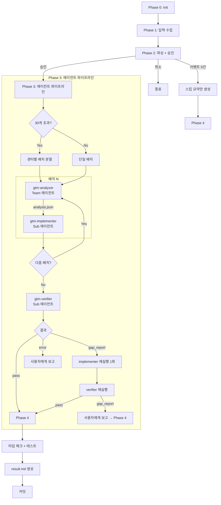
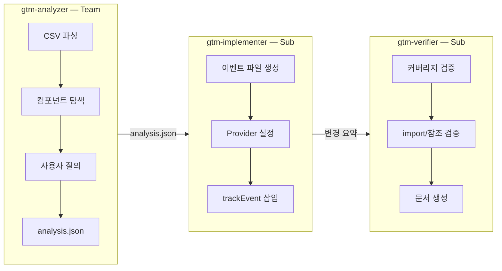

# GTM Tag — 워크플로우 & 아키텍처

## 파일 구조

```
plugins/gtm-tag/
├── .claude-plugin/
│   └── plugin.json                ← 플러그인 메타데이터
├── skills/
│   ├── init/SKILL.md              ← /gtm-tag:init (프로젝트 초기화)
│   ├── tag/SKILL.md               ← /gtm-tag:tag (오케스트레이터 Phase 0~4)
│   └── doctor/SKILL.md            ← /gtm-tag:doctor (설정 진단 + 자동 수정)
├── agents/
│   ├── gtm-analyzer.md            ← Team 에이전트 (sonnet/opus, 사용자 소통)
│   ├── gtm-implementer.md         ← Sub 에이전트 (sonnet, 코드 수정)
│   └── gtm-verifier.md            ← Sub 에이전트 (opus, 검증)
├── templates/
│   ├── project-config-template.md ← project-config 기본 템플릿
│   ├── requirement-template.md    ← 요구사항 문서 포맷
│   └── result-template.md         ← 결과 문서 포맷 (기획자 전달용)
├── module/                        ← gtm-tracker 모듈 번들
│   ├── index.ts, tracker.ts, registry.ts, types.ts, validation.ts, global.d.ts
│   ├── react/ (provider.tsx, hooks.ts, index.ts)
│   └── __tests__/ (프로젝트 복사 시 제외)
├── docs/
│   └── README.md                  ← 이 파일
└── README.md                      ← 플러그인 개요 + 사용법
```

## 프로젝트 설정 경로

```
{프로젝트 루트}/gtm-tag/project-config.md
```

> `.claude/` 하위가 아닌 프로젝트 루트의 `gtm-tag/` 폴더에 저장됩니다.

## 전체 워크플로우



## 에이전트 역할



### Analyzer 프롬프트 필수 컨텍스트 (8개)

오케스트레이터가 project-config.md에서 추출하여 전달:

1. requirement.md 경로
2. analysis.json 저장 경로 (배치 모드: `analysis-batch-{N}.json`)
3. gtm-tracker 모듈 경로 및 import alias
4. React import 경로 (`{alias}/react`)
5. Host App 공통 변수 목록
6. 이벤트 파일 출력 경로 패턴
7. 그룹 매핑 (센터, prefix, 라우트)
8. 스킵 규칙

### 에이전트 호출 패턴

```
# Team 에이전트 (사용자 소통 가능)
TeamCreate(name="gtm-analyzer", agentDef="${CLAUDE_PLUGIN_ROOT}/agents/gtm-analyzer.md", ...)

# Sub 에이전트 (순수 실행)
Agent(name="gtm-implementer", model="sonnet", ...)
Agent(name="gtm-verifier", model="opus", ...)
```

> 플러그인 에이전트는 `name` 기반으로 호출. `subagent_type`이 아닌 `name` 필드 사용.

## 배칭 로직

- 30개 이하 → 단일 배치
- 30개 초과 → 센터(그룹) 단위로 분할
- 단일 센터가 30개 초과여도 분할하지 않음
- 배치는 순차 실행 (batch N 완료 → batch N+1)
- 각 배치: analyzer → implementer
- 전체 완료 후: verifier 1회

## 데이터 흐름

```
CSV (기획자 제공)
  → requirement.md          (Phase 2: 파싱 + 승인)
  → analysis.json           (Analyzer: 컴포넌트 매핑)
  → {group}.events.ts       (Implementer: 이벤트 정의 파일)
  → 컴포넌트 수정            (Implementer: trackEvent 삽입)
  → event-coverage.md       (Verifier: 커버리지 검증)
  → integration-guide.md    (Verifier: 통합 가이드)
  → result.md               (Phase 4: 기획자 전달용 최종 산출물)
```

## Doctor 진단 체크리스트

| # | 카테고리 | 항목 | 에러 코드 |
|---|---------|------|----------|
| 1.1 | Config | 파일 존재 | CONFIG_MISSING |
| 1.2 | Config | 플레이스홀더 잔존 | CONFIG_PLACEHOLDER |
| 1.3 | Config | 필수 섹션 (8개) | CONFIG_INCOMPLETE |
| 2.1 | Module | 디렉토리 존재 | MODULE_MISSING |
| 2.2 | Module | 필수 파일 (9개) | MODULE_INCOMPLETE |
| 2.3 | Module | 핵심 export | MODULE_CORRUPTED |
| 3.1 | Import | tsconfig/jsconfig paths | IMPORT_PATH_MISMATCH |
| 3.2 | Import | import 일관성 | IMPORT_INCONSISTENT |
| 4.1 | Provider | GTMTrackerProvider 존재 | PROVIDER_MISSING |
| 4.2 | Provider | createTracker 인스턴스 | TRACKER_MISSING |
| 4.3 | Provider | 중복 검사 | PROVIDER_DUPLICATE |
| 5.1 | Events | 디렉토리 존재 | EVENTS_DIR_MISSING |
| 5.2 | Events | TypeScript 유효성 | EVENTS_TYPE_ERROR |
| 6.1 | Group | prefix 중복 | PREFIX_COLLISION |
| 6.2 | Group | 라우트 유효성 | ROUTE_NOT_FOUND |

