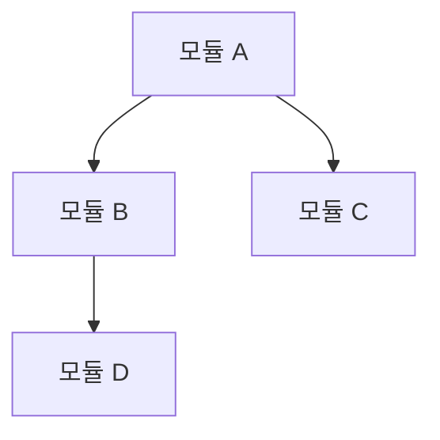
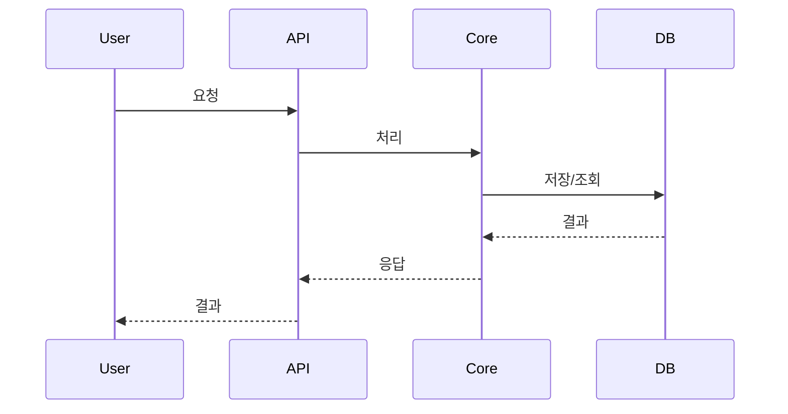

<!-- docsmith: auto-generated {YYYY-MM-DD} -->

# {title}

이 문서의 목적과 범위를 1-2문장으로 설명합니다.

## 구조 개요

## 모듈 설명

### 모듈 A

- **역할**:
- **의존**:
- **핵심 파일**:

### 모듈 B

- **역할**:
- **의존**:
- **핵심 파일**:

## 데이터 흐름

## 설계 결정

주요 설계 결정과 그 근거를 기술합니다.

## 관련 문서

- [[관련 문서 1]]
- [[관련 문서 2]]
